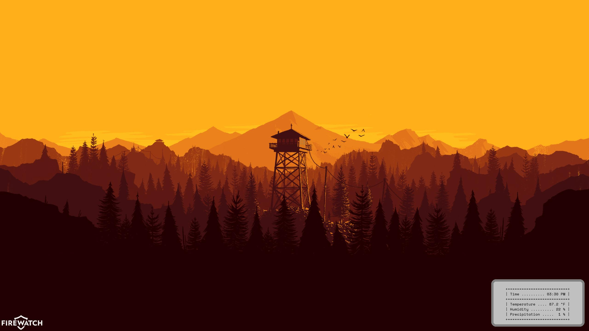

# WeatherDesk

WeatherDesk is a simple python application that allows you to set your desktop background according to the current weather at the given location. This project uses the [Open-Meteo](https://open-meteo.com/) weather API and the [Pillow](https://pypi.org/project/pillow/) library to generate an image containing a basic weather report and sets it as the PC descktop image.

## Weather Conditions

The program currently supports four times of day and four weather conditions for a total of sixteen possible desktop images.

Times:
- Morning
    - Within one hour of sunrise
- Day
    - More than one hour after sunrise and more than one hour before sunset
- Evening
    - Within one hour of sunset
- Night
    - All other times

Conditions:
- Normal
- Rain
- Snow
- Thunderstorms

## Weather Reporting

In addition to selecting an image based on the current weather / time of day the system adds a simple read out of the current conditions.

- Time the weather report was collected
- Current temperature
- Current Humidity
- Current chance of precipitation

## Requirements

Currently this project only supports the windows operating system

Other requirements:
- Python 3.9 or newer
- An internet connection
- The following python packages
    - [requests](https://pypi.org/project/requests/)
    - [python-dotenv](https://pypi.org/project/python-dotenv/)
    - [Pillow](https://pypi.org/project/pillow/)

## Configuration

WeatherDesk uses local environment variables to store lattitude and longitude information. To do this, you will need to make a .env file in the root directory with entries named LAT and LON. Here is an example using the coordinates for Chicago, IL

```python
LAT="41.88"
LON="-87.62"
```

## Automation

I have automated this script using the windows task scheduler. The task runs whenever I log into my account, and at 15 minute intervals.

The task targets the pythonw executable inside the project's .venv folder and runs the main.py file

## Future Goals

- Add support of other operating systems
- Configure units in .env file
- Improve error handling and reporting
- Make a DataClass to store weather reports
- Automated testing
- Configurable weather reporting
- Command line config options

## Sample Background



## Image Credits

The images I use for this project are based on the video game [Fire Watch](https://www.firewatchgame.com/) and were created by the artist [Junior Neves](https://www.reddit.com/user/Junior_Neves/)